[//]: # (https://docs.djangoproject.com/zh-hans/5.0/intro/tutorial01/)

[//]: # (https://www.bilibili.com/video/BV1cm4y127ce?p=38&spm_id_from=pageDriver&vd_source=4825f093b332088b99207eb66ec67b90)

[//]: # ()
[//]: # (<!--https://github.com/liuly0322/teacher-management-system/tree/main?tab=readme-ov-file-->)

[//]: # (https://v4.bootcss.com/docs/getting-started/introduction/)

[//]: # (https://www.cnblogs.com/tuyin/p/17142353.html#_label15)
# Lab3 实验报告
PB21061361

## 需求分析
本次实验要求实现教师科研工作的管理系统，其中需求：
- 教师表：包含教师的基本信息，工号、姓名、性别、职称。
- 论文表：包含论文的基本信息，论文编号、论文题目、发表期刊、发表日期、发表类型、发表级别。
- 项目表：包含项目的基本信息，项目编号、项目名称、项目来源、项目类型、经费、开始时间、结束时间。
- 课程表：包含课程的基本信息，课程编号、课程名称、学时、课程类型。

教师与论文、课程、项目之间的联系是多对多的关系，因此需要建立中间表。

## 创建数据表
### 教师表
教师表含有字段

字段| 类型| 说明 | 主键 | 外键
---|---|---|---|---
ID | char(5) | 教师工号 | PK
name | char
sex | int | 性别（2个可供选择的值）
position | int | 职称（11个可供选择的值）

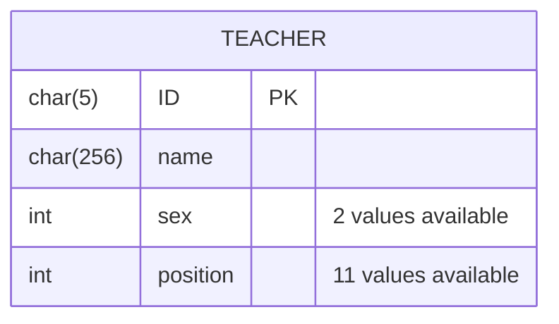
### 论文表
论文表含有字段

字段| 类型| 说明 | 主键 | 外键
---|---|---|---|---
ID | int | 论文编号 | PK
title | char(256) | 论文题目
source | char(256) | 论文来源
publish_date | date | 发表日期
publish_type | int | 发表类型（4个可供选择的值）
publish_level | int | 发表级别（6个可供选择的值）

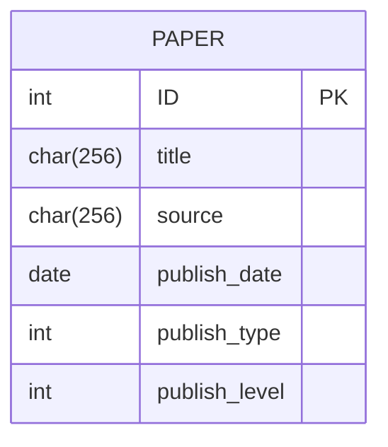
#### 教师-论文中间表
一篇论文必须至少一名作者。而一个教师不一定发表过论文。

字段| 类型| 说明 | 主键 | 外键
---|---|---|---|---
teacher_id | char(5) | 教师工号 |  | FK
paper_id | int | 论文编号 |  | FK
rank | int | 作者排名（最小值1）
is_corresponding_author | bool | 是否为通讯作者（0/1）

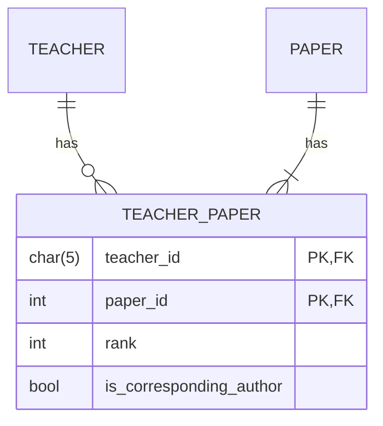
### 项目表
项目表含有字段

字段| 类型| 说明 | 主键 | 外键
---|---|---|---|---
ID | char(256) | 项目编号 | PK
name | char(256) | 项目名称
source | char(256) | 项目来源
type | int | 项目类型（5个可供选择的值）
fund | float | 经费
start_date | date | 开始年份
end_date | date | 结束年份
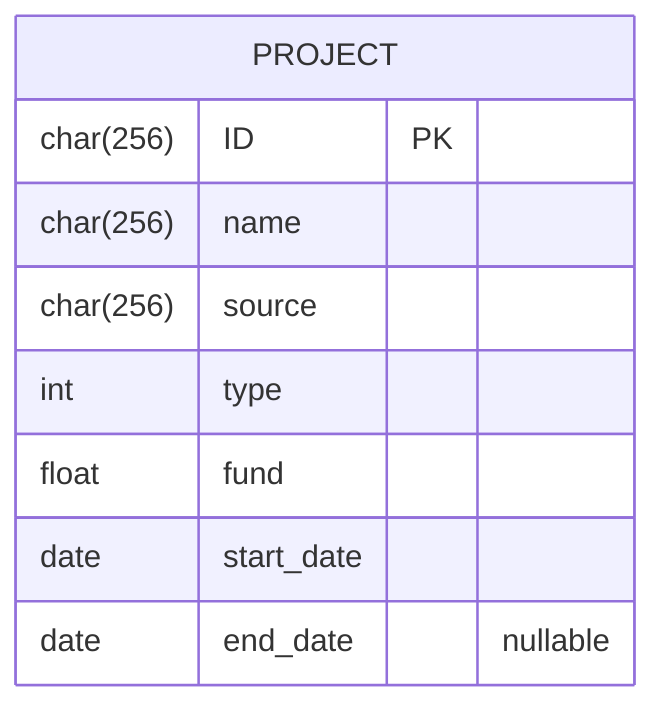
#### 教师_项目中间表

一个项目必须至少一名负责人。而一个教师不一定负责过某个项目。

字段| 类型| 说明 | 主键 | 外键
---|---|---|---|---
teacher_id | char(5) | 教师工号 |  | FK
project_id | char(256) | 项目编号 |  | FK
rank | int | 排名（最小值1）
fund_taken | float | 承担的经费


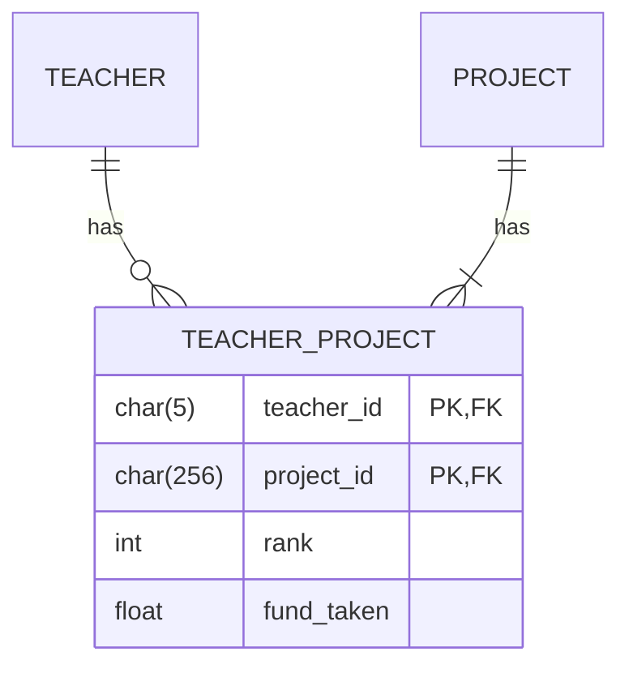
### 课程表
课程表按照课程种类划分，一类课程包含多个学期的课程。

字段| 类型| 说明 | 主键 | 外键
---|---|---|---|---
ID | char(256) | 课程编号 | PK
name | char(256) | 课程名称
hours | int | 学时
type | int | 课程类型（3个可供选择的值）
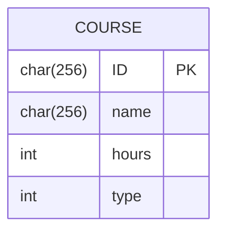
#### 教师-课程中间表
一个教师可以教授多门课程。而一门课程可以由多名教师教授。此外，这里的一门课程指的是一类课程的某个学期的课。

字段| 类型| 说明 | 主键 | 外键
---|---|---|---|---
teacher_id | char(5) | 教师工号 |  | FK
course_id | char(256) | 课程编号 |  | FK
year | int | 学年
semester | int | 学期
hours_taken | int | 教授学时

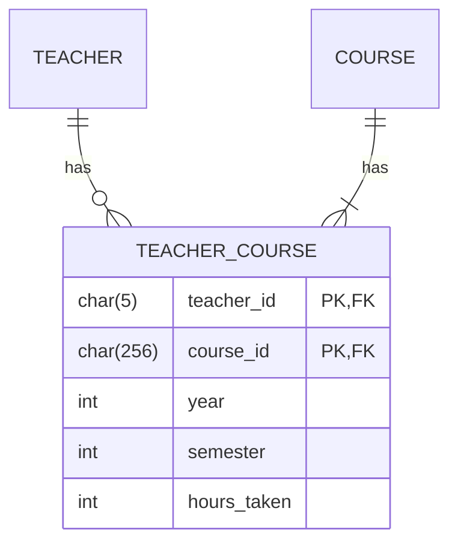

## 系统设计
本次实验实验python的django框架，使用mysql数据库。编写页面使用html+css+js，使用bootstrap框架美化页面。
该系统包含四个主要的功能页面：论文发表、项目管理、课程教授、个人统计。此外还有添加教师和课程的选项，但此为测试时添加使用（仅添加），实现较为简单
，不是本次实验的重点。

下面以论文发表为例，说明系统的设计思路。
### 整体思路
#### 增
对于一篇论文的增加，需要填写论文的基本信息，以及作者的信息。而作者可以有多个。因此，需要设计一个表单，包含论文的基本信息，以及一个作者的表单，可以动态添加多个作者。在提交表单时，需要将论文的基本信息和作者的信息一起提交。
#### 查
查找论文时，需要按照输入的条件进行筛选。可以按照论文的基本信息，也可以按照作者的信息进行筛选。因此，需要设计一个表单，包含论文的基本信息，
而这个表单可以复用“增”的表单，只需要稍加修改即可。即若没有输入任何内容时，返回所有论文；若输入了部分内容，则返回符合条件的论文。
#### 改
在查询到相关信息后，可以单个对论文的信息进行修改。修改时不允许修改主键，即论文编号。修改作者信息时，可以增加或删除作者。这里可以继续复用“增”的表单。
点击对应论文信息进行修改时，将该论文的原本信息填入表单中，若要进行修改则在原本数据的基础上进行修改。
#### 删
在查询到相关信息后，可以单个对论文的信息进行删除。删除时级联删除，即删除论文的同时删除对应论文相关的作者信息（并非删除教师本身）。

此外再设计到表单提交时，需要在**后端**进行数据的验证，保证数据的完整性。

### 整体框架
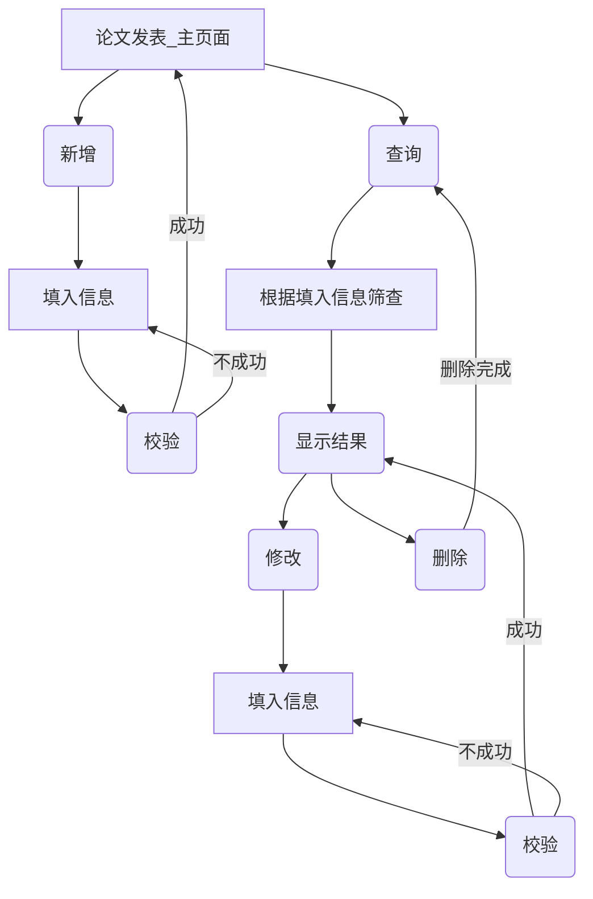


### 设计数据表
按照前面设计好的数据表，创建数据库表。这里使用django的ORM框架，创建模型类。ORM框架会自动创建数据库表。

```python
from django.db import models

class Paper(models.Model):
    type_choices = [
        (1, 'Full Paper'),
        (2, 'Short Paper'),
        (3, 'Poster Paper'),
        (4, 'Demo Paper')
    ]
    level_choices = [
        (1, 'CCF-A'),
        (2, 'CCF-B'),
        (3, 'CCF-C'),
        (4, '中文CCF-A'),
        (5, '中文CCF-B'),
        (6, '无级别')
    ]
    
    ID = models.IntegerField(primary_key=True, verbose_name="论文序号")
    title = models.CharField(max_length=256, verbose_name="论文名称")
    source = models.CharField(max_length=256, verbose_name="来源")
    publish_date = models.DateField(verbose_name="发表日期")
    publish_type = models.IntegerField(choices=type_choices, verbose_name="类型")
    publish_level = models.IntegerField(choices=level_choices, verbose_name="级别")
```
其中choices保证了publish_type和publish_level只能取预先定义的值。

类似地，设计完教师-论文表后，设计对应表的表单。
```python
class AuthorForm(forms.ModelForm):
    teachers = forms.ModelChoiceField(queryset=Teacher.objects.all(), label='作者',
                                     widget=forms.Select(attrs={'class': 'author-select form-control',}))
    rank = forms.IntegerField(min_value=1, label='排名',
                              widget=forms.NumberInput(attrs={'class': 'form-control'}))
    class Meta:
        model = Teacher_Paper
        fields = ['teachers', 'rank', 'is_corresponding_author']
        widgets = {
            'is_corresponding_author': forms.Select(attrs={'class': 'custom-select'})
        }
```
例如，对于教师-论文表，需要包含教师的选择框、排名的输入框、是否为通讯作者的选择框。在django中，前端会自动根据表单的定义生成对应的html代码。

由于作者可以有多个，因此需要设计一个表单集，包含多个作者的表单。这里使用django的forms中的modelformset_factory方法。
```python
AuthorFormSet = forms.modelformset_factory(model=Teacher_Paper, form=AuthorForm,
                                           formset=AuthorFormSet_custom, extra=1)
```

因此，一个页面中输入的信息应包含：一个论文表单，以及可动态添加的多个作者表单的表单集。
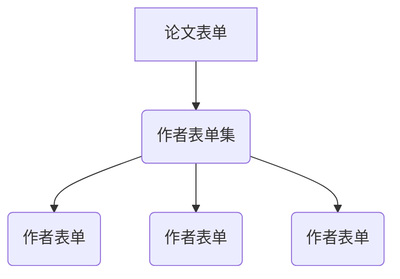

### 设计页面
在django中，页面的设计主要在html文件中进行。而在html文件中，可以使用django的模板语言，将后端的数据传递到前端。

可以设计一个函数，当跳转到url为`/paper/add`时，调用该函数。该函数会返回一个包含论文表单和作者表单集的页面。
```python
def paper_manage(request):
    paper_form = PaperForm()
    author_form_set = AuthorFormSet(queryset=Teacher_Paper.objects.none())
    return render(request, 'PaperManage.html',
                  {'paperForm': paper_form, 'authorFormSet': author_form_set,
                   'length': length})
```
在前端的html模版中，使用模版语法，将后端传递的数据填入表单中。
```html
<div class="form-row">
  
  <div class="form-group col-md-{{ length.forloop.counter0 }}">
      <label>{{ field.label }}</label>
      {{ field }}
      <span style="color: #c82333;" class="error-msg">{{ field.errors.0 }}</span>
  </div>
  
</div>
```
此语法会自动循环生成对应输入框的html代码。其余输入框类似，不再赘述。
### 添加数据
#### 动态添加作者
可以使用js动态添加作者表单。在点击“添加作者”按钮时，会在页面中添加一个新的作者表单。其本质是复制一个作者表单，将其添加到页面中。

由于单个作者表单的id可能不同，而django的表单收集通过id区分，因此需要在添加作者表单时，修改其id。同时修改表单集中表单的数量，这样能使django正确地收集表单数据。
```javascript
<script type="text/javascript">
    $(document).ready(function(){
      $('#addAuthorButton').click(function(){
                var newIndex = $('#paperForm .form-row').length - 1;
                console.log(newIndex);
                //销毁 select2
                $('#authorForm-container .author-select').select2('destroy');
                var newFormHtml = $('#authorForm-container .form-row:first').clone();
                newFormHtml.find(':input:not(button), select, span').each(function(){
                    var name = $(this).attr('name');
                    var id = $(this).attr('id');
                    if (name){
                        $(this).attr('name', name.replace('-0-', '-' + newIndex + '-'));
                    }
                    if (id){
                        $(this).attr('id', id.replace('-0-', '-' + newIndex + '-'));
                });

                $('#authorForm-container').append(newFormHtml);
                $('#author_num').val(newIndex + 1);
                $('#id_form-TOTAL_FORMS').val(newIndex + 1);
                // select 2 初始化复制的元素
                initializeSelect2('.author-select');
                checkDeleteButton();
            });
    }); 
    </script>
```
要实现删除一个作者类似，不再赘述。

当提交表单后，需要在后端进行数据的验证。这里使用django的form表单验证。在views.py中，可以使用form.is_valid()方法，判断表单是否合法。
```python
def paper_add(request):
    paper_form = PaperForm(data=request.POST)
    author_form_set = AuthorFormSet(data=request.POST or None)
    print(request.POST)
    if paper_form.is_valid() and author_form_set.is_valid():
        instance_paper = paper_form.save()
        instance_author = author_form_set.save()
        data_dic = {"status": True, "error": []}
        return HttpResponse(json.dumps(data_dic))
```
大多数情况下，django会自动验证数据的合法性。例如数据是否是必须的，数据要求的类型必须符合。

但有时需要自定义验证方法。此时可以覆写表单的clean方法，在原有验证的基础上加入自定义的数据验证。例如，论文的标题不能含有单引号和双引号，可以写成：
```python
    def clean_title(self):
        title = self.cleaned_data['title']
        if "'" in title or '"' in title or '’' in title or '“' in title or '”' in title:
            raise forms.ValidationError('标题中不能包含单引号或双引号')
        return title
```
类似地，可以定义在整个教师-论文信息表单集的验证操作，例如教师不能重复，排名不能重复，通讯作者只能有一个都可以实现。
```python
    # 作者不能为空
    for form in self.forms:
        if not form.cleaned_data.get('teachers', None):
            raise forms.ValidationError('作者不能为空')

    if any(self.errors):
        return

    # 作者不能重复
    authors = []
    for form in self.forms:
        author = form.cleaned_data.get('teachers', None)
        if author in authors:
            raise forms.ValidationError('作者重复')
        authors.append(author)
```
在提交表单后，若表单数据验证通过，则通过`form.save()`方法将数据保存到数据库中。否则，返回错误信息到前端中。

提交时使用ajax提交，返回json数据。在前端中，可以根据返回的数据，判断是否提交成功。若成功，则弹出成功弹窗；否则，显示错误信息。

### 查询数据
查询数据时，需要根据输入的条件进行筛选。在django中，可以使用filter方法，根据输入的条件组成一个查询字典，然后进行筛选。
```python
def paper_search(request):
    paper_form = PaperForm(data=request.GET, operation_type='query')
    print(request.GET)
    data_dict = {}
    for field in paper_form.fields:
        data = request.GET.get(field, '')
        if data:
            data_dict[field] = data

    papers = Paper.objects.filter(**data_dict)
```
这等价于SQL中的select语句后的where中填入查询条件。若没有输入任何条件，则返回所有数据。
若想要在一个页面上不现实所有的查询结果，可以使用分页器。本次实验自定义了一个分页模块，根据返回结果的数量，自动分页。代码过多不易于展示，可见`Teachers/tools/Page.py`.

完成分页后，直接将数据返回前端即可。

### 修改数据
根据查询到的数据，点击“编辑”修改。修改时表单与提交的表单完全一致，但是需要将原本的数据填入表单中。这里可以使用forms的queryset进行定义。
即相当于再次查询到特定论文id的数据，将其填入表单中。

初次点击时，请求对应论文的详细信息，填入表单中，使用GET方法。点击提交时，将表单数据提交到后端，使用POST方法。因此可以将页面方法整入同一个url中。
```python
def paper_edit(request, id='0'):
    original_paper_data = Paper.objects.get(ID=id) # 获取初始数据
    if request.method == 'GET':
        # 填写初始数据后返回到前端

    if request.method == 'POST':
      # 同“增”进行数据校验后提交修改
```
由于修改论文信息时，只需要修改单个论文的信息，故可以只使用update方法。但是修改作者信息时，可能作者数量、信息与此前不同，比较方便的做法是先删除原有作者信息，再添加新的作者信息。

```python
paper_form.save()
origin_teacher_paper_data = Teacher_Paper.objects.filter(paper_id=id)
# 删除
for data in origin_teacher_paper_data:
    data.delete()
# 重新写入
author_form_set.save(paper_id=id)
```

此外，为了不引起不必要的麻烦，可以在编辑论文信息时，禁止修改主键。即论文编号。这里可以在前端中将其设置为disabled。
```python
    def __init__(self, *args, **kwargs):
        operation_type = kwargs.pop('operation_type', None)
        self.operation_type = operation_type
        super(PaperForm, self).__init__(*args, **kwargs)
        if operation_type == 'update':
            self.fields['ID'].disabled = True
```
### 删除数据
直接删除掉对应论文的数据，并且设置级联删除即可。
```python
def paper_delete(request, id='0'):
    Paper.objects.get(ID=id).delete()
    return redirect('/papers/search/')
```

## 项目管理
其设计和上面的论文发表基本相同。只是在添加作者时，需要添加经费信息，并且验证经费和等于总经费。因此在提交表单时加入验证信息
```python
# 总经费必须等于项目经费
        total_funds = 0
        for form in self.forms:
            total_funds += float(form.cleaned_data.get('fund_taken', 0))
        print(self.original_data.__dict__)
        fund = float(self.data.get('fund', 0) or self.original_data.fund)
        if total_funds != fund:
            raise forms.ValidationError('总经费必须等于项目经费')
```

另外，在编辑时，不可修改项目经费，可以置fund栏为disabled.
```python
    def __init__(self, *args, **kwargs):
        operation_type = kwargs.pop('operation_type', None)
        self.operation_type = operation_type
        super().__init__(*args, **kwargs)
        if operation_type == 'update':
            self.fields['ID'].disabled = True
            self.fields['fund'].disabled = True
```
其余框架与论文发表相同，不再赘述。此外课程管理与项目管理类似，不同的地方在于课程管理中直接选择课程而并非添加课程。
修改和删除课程时，应当修改的是某个学期的课程。此时把课程的超键可以设置为（课程编号，教师编号，学年，学期）。即一名老师只能教授对应一个学期的课。

## 个人统计
个人统计中，需要根据教师的工号，对应的起始和结束年份，统计出教师的论文、项目、课程的数量。

这里可以新建一个表单，然后对应数据提交后，检查起始年份结束年份的合法性（例如起始年份不能大于结束年份）。
然后根据工号，起始年份和结束年份，查询对应的数据。由于这里查询大多需要用到外键关联，可以使用django的Q方法以及select_related方法。其相当于SQL中的join操作。

```python
 # 教学情况
    teacher_courses = Teacher_Course.objects.filter(Q(teacher_ID=teacher) \
                                                    & Q(year__gte=start_year) & Q(year__lte=end_year)).select_related(
        'course_ID')
```
例如，对于教学情况，其等价于
```sql
select * from Teacher_Course, Course 
         where Teacher_Course.teacher_ID = teacher.ID 
           and Teacher_Course.year >= start_year 
           and Teacher_Course.year <= end_year 
           and Teacher_Course.course_ID = Course.ID
```
然后再根据返回的数据，发送到前端完成数据抽取和显示。

## 结果展示
### 论文发表
添加论文时，输入对应的信息。若信息不全或有误，则会产生提示如下。
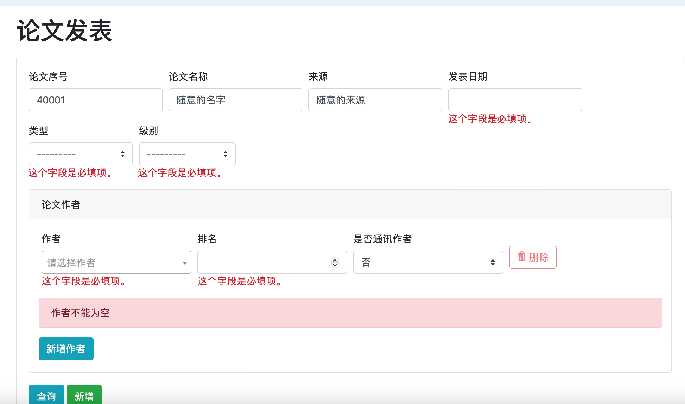
添加成功时，会弹出提示框。
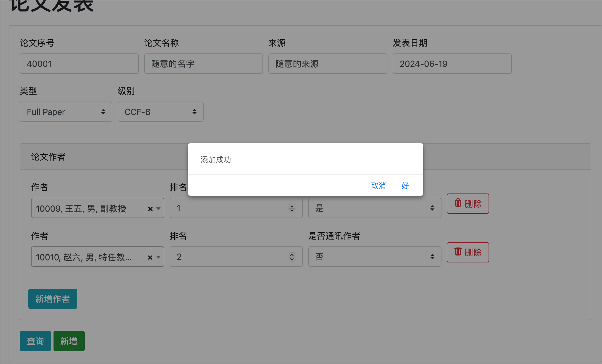
查询时，若不输入数据，可以查询所有论文。
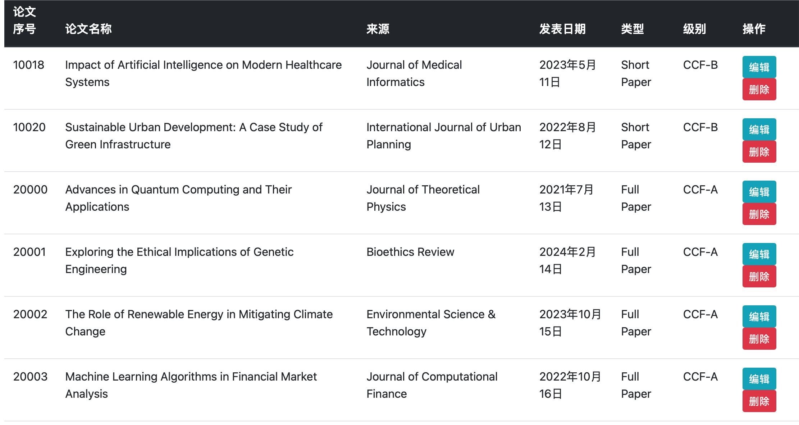
点击编辑时，进入编辑页面。
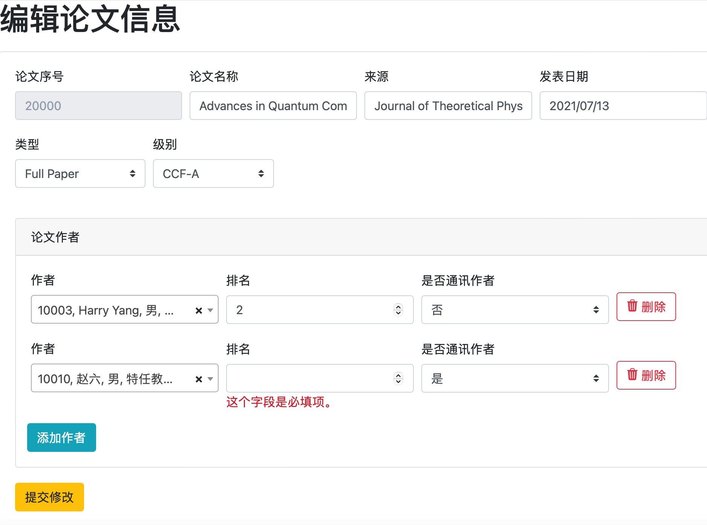
编辑完成后提交修改。
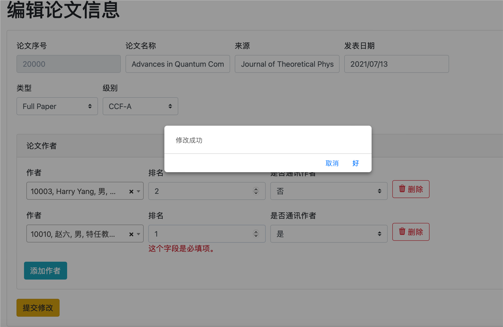
删除时直接删除后，跳回搜索页面。可以看到删除的论文已经不在其中。

其余类似。
### 个人统计
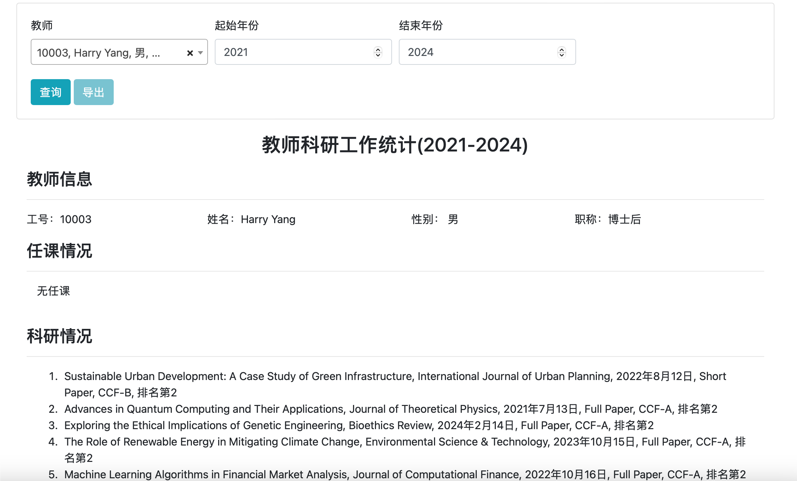
点击个人统计，输入对应的工号，起始年份和结束年份，点击查询。可以看到对应的信息。迫于时间关系，导出部分未完成。

## 总结
本次实验主要是对数据库的连接操作，期间查阅了大量资料，并初步掌握了html、css、js的静态网页编写技术，同时利用django的ORM框架，实现了对数据库的增删改查操作。

利用ORM（Object Relational Mapping）框架，可以将数据库的表映射为python的类，通过对类的操作，实现对数据库的操作。这样可以大大减少对数据库的操作，提高了开发效率。相比于传统SQL有不少优势。

不过，ORM框架也有一些缺点。例如，对于复杂的查询，ORM框架可能很难实现。本次还只是简单的增删改查操作，对于更复杂的查询，可能需要使用原生SQL语句。此外，它也可能存在响应速度不够快的问题。

而django的使用也要遵循一定的框架限制，因此对于初学者而言，用其实现一个复杂的系统是比较费时费力的。因此在学习django上页花费了一些时间。


# 使用方法
## 连接MYSQL
- 安装mysqlclient
  ```shell
    pip install mysqlclient
  ```

- 启动MySQL
  ```
   mysql.server start
  ```
在 `TeacherDBWeb`目录下，执行命令
```
python manage.py runserver
```
默认端口号为8000，地址为`127.0.0.1/8000`. 在浏览器中输入该地址即可访问。