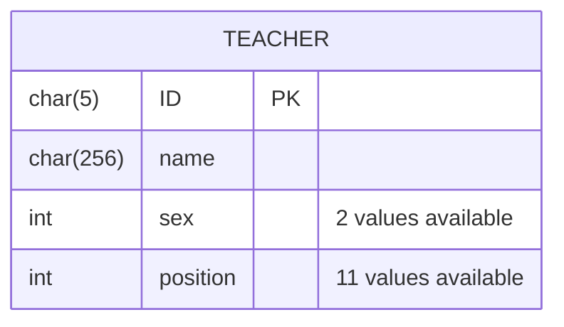
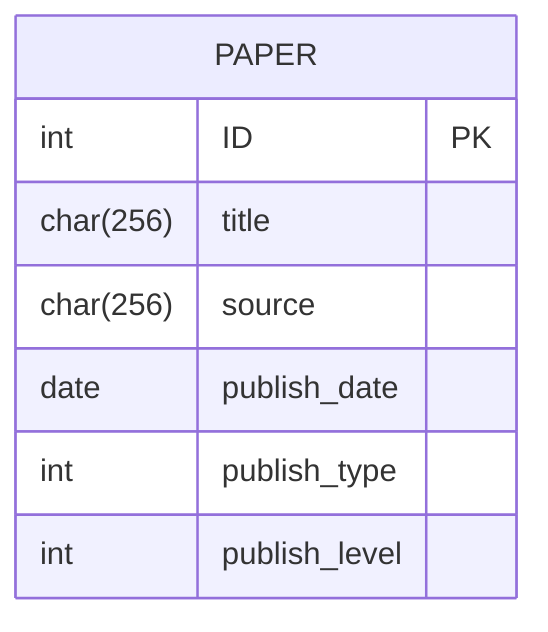
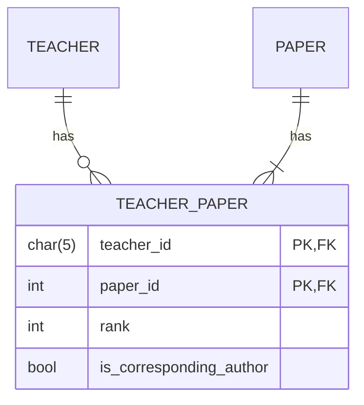
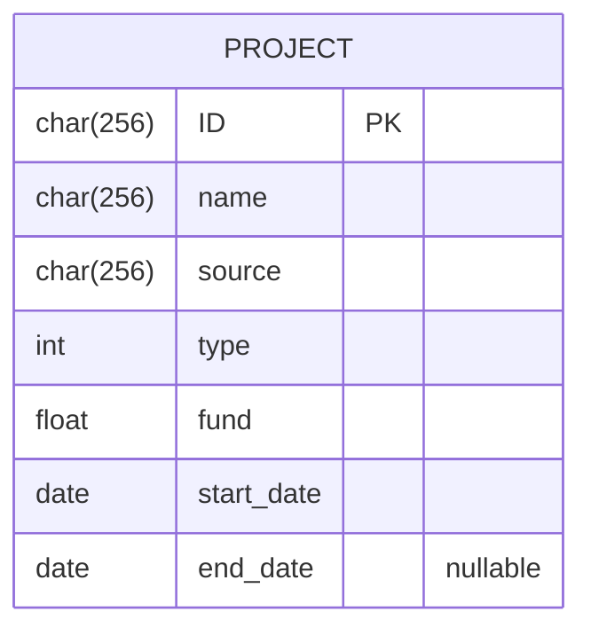
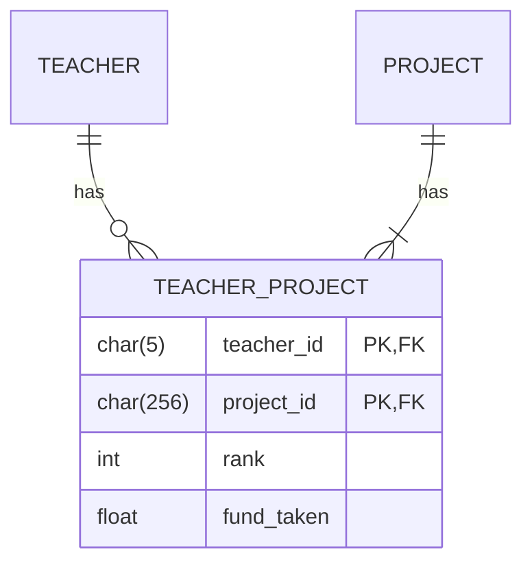
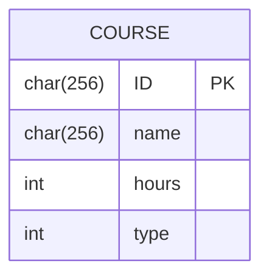
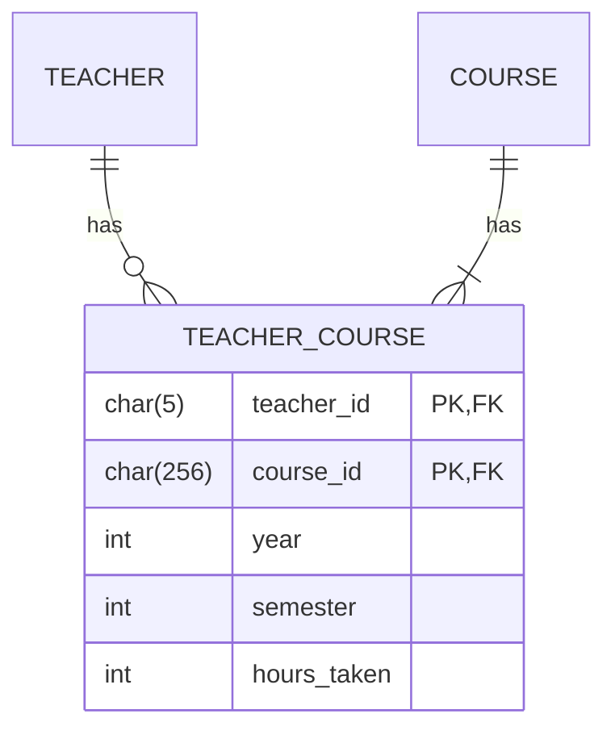

https://docs.djangoproject.com/zh-hans/5.0/intro/tutorial01/
https://www.bilibili.com/video/BV1cm4y127ce?p=38&spm_id_from=pageDriver&vd_source=4825f093b332088b99207eb66ec67b90

<!--https://github.com/liuly0322/teacher-management-system/tree/main?tab=readme-ov-file-->
https://v4.bootcss.com/docs/getting-started/introduction/
https://www.cnblogs.com/tuyin/p/17142353.html#_label15

## 连接MYSQL
- 安装mysqlclient
  ```shell
    pip install mysqlclient
  ```

- 启动MySQL
  ```
   mysql.server start
  ```


## 创建数据表
### 教师表

### 论文表

#### 教师-论文中间表
一篇论文必须至少一名作者。而一个教师不一定发表过论文。

### 项目表

#### 教师_项目中间表

### 课程表

#### 教师-课程中间表


